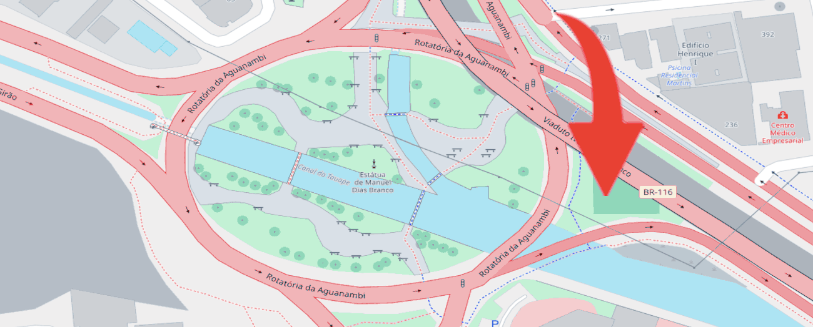

## Images

Reference images from `src/content/images/` with a relative path. Astro processes them at build time (resize, AVIF/WebP, dimensions emitted in the markup).

Click an image in a rendered post to open the lightbox. Text in `_italics_` immediately after the image is treated as the caption.

Skip any step that does not apply.

_Optional caption goes here._

Tone builds to `dist/`. Most hosts only need:

| Setting          | Value           |
| ---------------- | --------------- |
| Build command    | `npm run build` |
| Output directory | `dist`          |
| Node             | 22.12 or newer  |

- **Markdown You Will Actually Use** — the prose styles in one page.
- **Change the Look in One File** — color, spacing, type.
- **When to Reach for MDX** — using an Astro component inside a post.

_Optional caption goes here._

The starter is a small Astro site. By the end of this post you will have your name on the home page, one real post, and a deploy that points to your domain.

