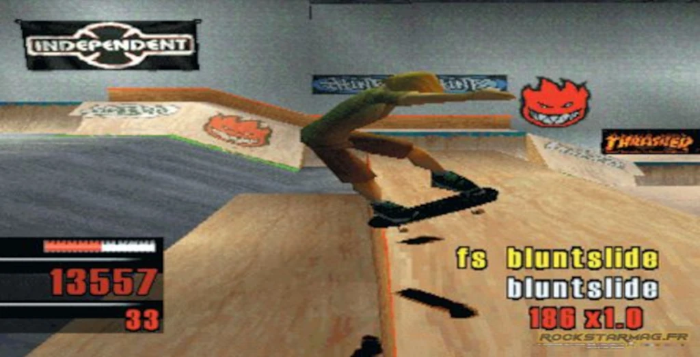

If you want a different look for your site, start in one file:

_Optional caption goes here._

The core colors, spacing steps, and type scale live there. Components and pages read those variables first, while specialized surfaces such as code highlighting keep a small local palette. Change the core variables and most of the site follows.

## Change the accent color

Find `--color-blue` near the top. There are three copies:

1. Light mode under `:root`
2. Dark mode inside the `prefers-color-scheme: dark` media query
3. Forced dark via `[data-theme='dark']`

If a value answers "what does this look like?", it is a token. If it answers "what does this say?" or "where does it go?", it is config.
