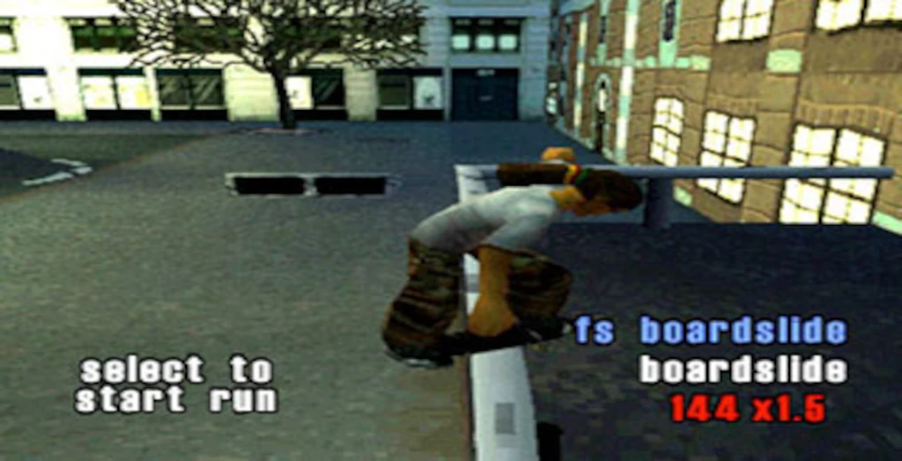

import FigureNote from '../../components/FigureNote.astro';

Markdown handles most writing. Headings, paragraphs, links, lists, quotes, code, images. Stay in Markdown by default.


_Optional caption goes here._

Switch to MDX when an Astro component needs to live inside the post — not next to it, not below it, but in the exact place the prose is referring to.

This file is an MDX file. Watch what `FigureNote` does here:

<FigureNote title="MDX example">
  This block is an Astro component called from inside the post. The prose around it does not break,
  and the component shares the site's design tokens.
</FigureNote>

The component sits inline. The article continues. That is the only thing MDX is for.

## How to switch a post to MDX

1. Rename the file from `.md` to `.mdx`.
2. After the frontmatter, import the component:

   ```mdx
   import FigureNote from '../../components/FigureNote.astro';
   ```

3. Use it like an HTML tag in the body:

   ```mdx
   <FigureNote title="Tip">Inline content goes here.</FigureNote>
   ```

MDX is a small upgrade, not a default. Use it when the upgrade pays for itself.
